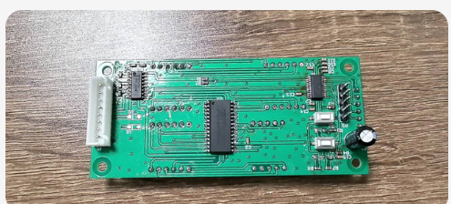
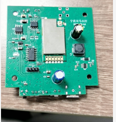
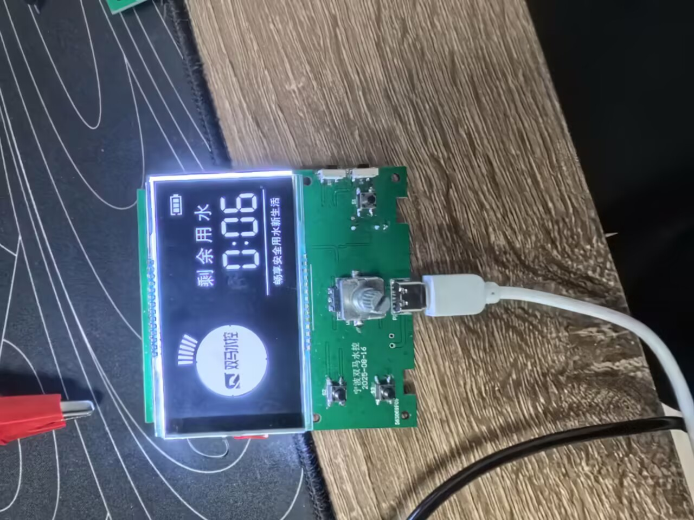
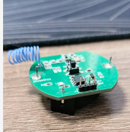
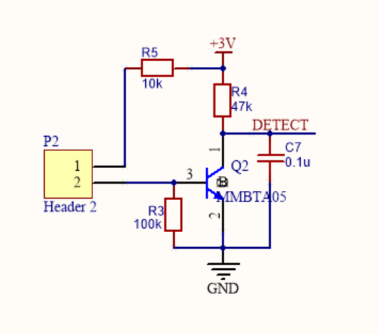
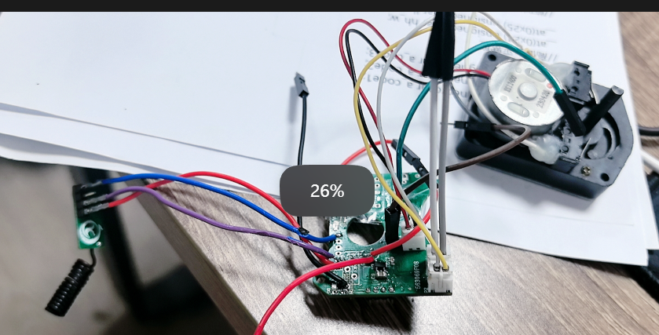

# 实习项目技术介绍

> 说明：本文档用于整理实习期间参与项目的技术介绍。

---

## 一、实习项目总体说明

### 1. 实习项目概况

- 实习单位：南京长城医疗器械有限公司
- 4个月

### 2. 技术栈概述

- 开发方向：嵌入式单片机开发
- 涉及内容：
  - 使用和泰和辉芒微的芯片
  - 对寄存器操作配置外设
  - 多事件项目的软件架构
  - 低功耗控制
  - 高噪声环境下的433接收逻辑设计
  - modbus解析帧和环形缓冲区

---

## 二、项目一：nixie_tube 项目技术介绍

### 1. 项目名称

Nixie Tube 数码管显示控制项目

### 2. 项目背景 / 应用场景

核磁共振磁干扰，电容屏失效，换数码管，采用的和泰的芯片,在对外接口采用的232电平也是防干扰作用

### 3. 项目目标

读UART,在数码管上显示接收到的信息,如果定时时间到了要返回时间

### 9. 项目难点与解决方案

数码管驱动芯片采用的TM1640,IIC传输,要写时序

### 10. 项目收获

熟悉开发流程

---

## 三、项目二：CAT2PRO 项目技术介绍

### 1. 项目名称

CAT2PRO 项目

### 2. 项目背景 / 应用场景

我在公司给一个硬件工程师打下手,但是公司没什么活,他接私活,他画板子,我写程序

这是一个控制阀门的接收端,可以开关阀门,

还外接了一个水流发电,给电池充电

### 3. 项目目标

MCU低功耗,433周期休眠,对433信息处理后实现开关阀功能

### 4. 硬件平台 / 核心器件

- 主控芯片：FT61FC4
- 通信模块：433
- 传感器 / 执行器：阀门
- 电源方案：可充电

### 5. 主要功能

- 功能1:长按一个按键,进入对码模式,这样只接受选定地址的433,不会被别人恶意关闭
- 功能2:modbus解析帧,实现控制
- 功能3:低功耗设计,平均电流45UA，比不休眠（21mA）减少467倍

### 7. 软件设计思路

HAL,DRV,APP,表驱法

### 9. 项目难点与解决方案

- 433模块设置,在电脑上的433一旦发送就卡,后来发现是发送功率太大,USB转TTL电流不够
- 433周期休眠,发送方前导码设置太短导致接受不到
- 事件太多导致软件太乱,后来去学了更好的软件架构
- MCU引脚太细,短路
- 休眠和中断冲突,看数据手册对寄存器设置得以解决

---

## 四、项目三：CAT1PRO/project 项目技术介绍

### 1. 项目名称

CAT1PRO project 项目

### 2. 项目背景 / 应用场景

上一个项目的主面板,用来显示数据,设置开关阀的时间,远程WIFI操控,通过433和接收端通信

### 3. 项目目标

WIFI链接-----433-----开关阀,主控面板还有旋转编码器和按键用来设置时间,有一个链接标志显示是否连接WiFi

### 4. 硬件平台 / 核心器件

LCD,HT67F2362,编码器,WBR3(wifi),GL400(433)

### 5. 主要功能

- 功能1：【填写】
- 功能2：【填写】
- 功能3：【填写】
- 功能4：【填写】

### 7. 软件设计思路

【可填写：模块划分、协议解析流程、状态机设计、主程序运行逻辑等】

### 9. 项目难点与解决方案

---

## 五、项目四：Leakage_alarm 项目技术介绍

### 1. 项目名称

Leakage Alarm 漏水报警项目

### 2. 项目背景 / 应用场景

还是他接的私活,自己开的公司,对标小米,主打价格低,这是接收端,有两个探针,一旦漏水就用433发送报警,还有个按计,按下就关阀,功能和那两个探针一样

### 4. 硬件平台 / 核心器件

- 主控芯片：FT60E211
- 报警模块：XYT5566

### 5. 主要功能

漏水会产生下降沿,MCU从休眠中苏醒,并且通过433发送信息,这个433是只能单引脚发送信息,通过中断发送EV1527协议

长按按键发送433地址0X12345

### 6. 核心技术内容

- 低功耗
- XYT5566发数据
- 漏水检测电路
- 

### 7. 软件设计思路

功能太简单,状态机

### 9. 项目难点与解决方案

发现给的例程有问题,delay_us和我们这个芯片相差很多,拿逻辑分析仪调好的

2天时间

---

## 六、项目五：leakage_alarm_control2 项目技术介绍

### 1. 项目名称

leakage_alarm_control2 漏水报警控制项目

### 2. 项目背景 / 应用场景

上面的配套,WIFI接收,发送阀门状态,是否漏水,用户通过WIFI关阀门开阀门

### 4. 硬件平台 / 核心器件

- 主控芯片：FT61C42
- 控制对象：按键,LED,433,WIFI

### 7. 软件设计思路

HAL,DRV,APP,表驱法(改良了,在中断那里使用回调函数,把信息记录然后指标职位,信息翻译成事件在主循环处理,然后用以前的表驱法处理事件)

### 9. 项目难点与解决方案

- 定时器配置有问题,反复拿示波器和逻辑分析仪查看433接收端,后来才想到可能是定时器有问题,
- 433发射端最后一位没有上升沿,发射和接收的例程配合有问题,断点一点一点调试(电路设计问题导致的无法DEBUG)
- 接收端例程也有问题,实际接收端接收到的波非常嘈杂,怀疑数据手册造假了,原有是只有较长时间的同步码,这不适配环境,我加了一个人为制造的方波作为前导码,
- 他WIFI板子设计的有问题,4/11:还没画完,但是我必须回学校了,我5月回来给他搞完WIFI部分

### 10. 项目收获

心态
